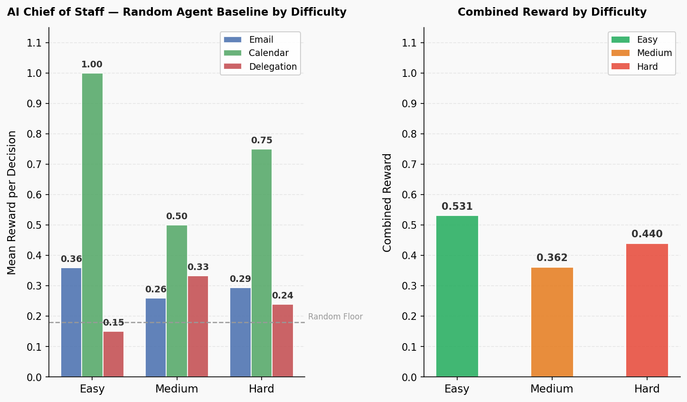

# 🗂️ AI Chief of Staff — RL Environment

> Teaching an LLM to manage your Monday morning — emails, calendar conflicts, and task delegation, all in one reinforcement learning environment.

## Status

- ✅ Environment: Built and tested
- ✅ Baseline: Random agent scored (email 0.36 / calendar 0.75 / delegation 0.15)
- ⏳ Inference: Qwen2.5-7B baseline run (in progress)
- ⏳ Training: GRPO run (next step)
- ⏳ Deployment: HuggingFace Spaces push (next step)

---

## Overview

This project is a multi-phase reinforcement learning environment that trains an AI agent to act as an executive Chief of Staff. The agent learns to triage emails, resolve calendar conflicts, and delegate tasks under real-world constraints like urgency, VIP hierarchy, and limited resources. It is built on the [OpenEnv](https://github.com/openenv) framework, which provides a standardised gym-style API for language model training environments.

---

## The Three Phases

| Phase | What the agent decides | Example |
|---|---|---|
| Email Triage | Category, priority, and suggested response for each incoming email | Classify a production outage email as `urgent/urgent` and approve a failover |
| Calendar Conflict Resolution | Which of two overlapping events to reschedule, cancel, or delegate | Protect a board member call by rescheduling a junior 1:1 |
| Task Delegation | Who should handle each task: self, junior, manager, external, or drop | Escalate a critical CVE patch to an external security specialist |

---

## Environment Design

**Observation space** — A plain JSON dict describing the current item. In the email phase this includes `email_id`, `subject`, `body`, `sender`, `timestamp`, `inbox_position`, and `total_emails`. In the calendar phase it includes both event objects with VIP flags and a list of valid resolutions. In the delegation phase it includes task metadata, urgency, and whether technical expertise is required.

**Action space** — A unified JSON dict with a `phase` field. Only the fields relevant to the current phase are scored; extra fields are ignored.

**Episode flow:**

```
reset(task_id)
      │
      ▼
[EMAIL phase] ──── score each email ────► advance
      │  (all emails done)
      ▼
[CALENDAR phase] ── score each conflict ─► advance
      │  (all conflicts done)
      ▼
[DELEGATION phase] ─ score each task ───► advance
      │  (all tasks done)
      ▼
    done=True  →  phase_rewards summary returned
```

Each step returns `{ observation, reward, done, info }`. The `info` dict always contains `phase` and `phase_rewards` so the agent can track its own progress.

---

## Reward Functions

| Phase | Sub-component | Weight | Scoring logic |
|---|---|---|---|
| Email | category_score | 0.40 | 1.0 exact match, 0.5 near-miss, 0.0 wrong |
| Email | priority_score | 0.30 | 1.0 exact, 0.5 one level off, 0.0 two+ levels off |
| Email | response_score | 0.30 | Fraction of required keywords present in suggested_response |
| Email | urgent bonus | +0.05 | Applied when agent correctly identifies urgent email |
| Email | false-urgent penalty | −0.10 | Applied when agent marks low/medium email as urgent |
| Calendar | resolution_score | 0.50 | 1.0 correct, 0.5 acceptable, 0.0 wrong |
| Calendar | vip_protection_score | 0.30 | Penalised for cancelling VIP events when alternatives exist |
| Calendar | rationale_score | 0.20 | 1.0 for 5+ word rationale, 0.5 for 1–4 words, 0.0 empty |
| Delegation | assignee_score | 0.50 | 1.0 correct, 0.5 acceptable, 0.0 wrong; −0.3 for dropping urgent tasks |
| Delegation | message_quality_score | 0.30 | Fraction of required keywords in delegation_message |
| Delegation | escalation_appropriateness | 0.20 | 1.0 if technical→manager/external or non-technical→self/junior |

**Combined episode reward** (for logging): `0.40 × mean_email + 0.35 × mean_calendar + 0.25 × mean_delegation`

---

## Task Difficulties

| Task ID | Emails | Conflicts | Tasks | Notes |
|---|---|---|---|---|
| `easy_cos` | 5 | 2 | 2 | Clear categories, obvious VIP priority, one urgent cascade |
| `medium_cos` | 10 | 3 | 3 | Ambiguous support vs spam, one dual-VIP conflict with no perfect answer |
| `hard_cos` | 15 | 5 | 5 | Full crisis chain: SEV-1 outage → war room conflict → rollback delegation; CVE cascade; SOC 2 deadline |

---

## Baseline Results (Random Agent)

Results from `python3 test_smoke.py` — random agent, no LLM:

| Task | Steps | Email | Calendar | Delegation | Combined |
|---|---|---|---|---|---|
| easy_cos | 9 | 0.360 | 1.000 | 0.150 | 0.482 |
| medium_cos | 16 | 0.260 | 0.500 | 0.333 | 0.362 |
| hard_cos | 25 | 0.294 | 0.750 | 0.240 | 0.440 |



---

## Quick Start

```bash
# Clone and install
git clone https://huggingface.co/spaces/your-username/ai-chief-of-staff
pip install -r requirements.txt

# Run the server
python3 -m uvicorn server.app:app --host 0.0.0.0 --port 7860 --reload

# Run smoke test (no API key needed)
python3 test_smoke.py

# Run LLM inference (requires OpenAI API key)
export OPENAI_API_KEY="your-key-here"
python3 inference.py
```

---

## API Reference

### `GET /reset?task_id=easy_cos`
Starts a new episode. Returns the first observation.

```bash
curl "http://localhost:7860/reset?task_id=easy_cos"
```

```json
{
  "phase": "email",
  "email_id": "e001",
  "subject": "URGENT: Production API returning 503 errors",
  "body": "...",
  "sender": "oncall@ops.company.com",
  "inbox_position": 0,
  "total_emails": 5
}
```

---

### `POST /step`
Submits an action for the current phase. Returns observation, reward, done, and info.

**Email step:**
```bash
curl -X POST "http://localhost:7860/step" \
  -H "Content-Type: application/json" \
  -d '{"phase":"email","email_id":"e001","category":"urgent","priority":"urgent","suggested_response":"Approving failover now."}'
```

```json
{
  "observation": { "phase": "email", "email_id": "e002", "..." : "..." },
  "reward": 0.95,
  "done": false,
  "info": {
    "phase": "email",
    "phase_rewards": { "email": 0.95, "calendar": 0.0, "delegation": 0.0 },
    "category_score": 1.0,
    "priority_score": 1.0,
    "response_score": 1.0
  }
}
```

**Calendar step:**
```bash
curl -X POST "http://localhost:7860/step" \
  -H "Content-Type: application/json" \
  -d '{"phase":"calendar","conflict_id":"c001","resolution":"reschedule_b","rationale":"Post-mortem with CTO takes priority over vendor demo."}'
```

---

### `GET /state`
Returns current phase and cumulative rewards without advancing the episode.

```bash
curl "http://localhost:7860/state"
```

```json
{
  "phase": "calendar",
  "phase_rewards": { "email": 3.72, "calendar": 0.0, "delegation": 0.0 },
  "done": false
}
```

---

## Training

This environment is designed for GRPO (Group Relative Policy Optimisation) training via [HuggingFace TRL](https://github.com/huggingface/trl) and [Unsloth](https://github.com/unslothai/unsloth). The reward signal from each step is used directly as the GRPO reward, with the combined episode score as the final training objective.

The curriculum progresses from `easy_cos` → `medium_cos` → `hard_cos`, allowing the model to learn basic triage before facing full crisis cascade scenarios.

Training notebook: `training/train_grpo.ipynb` *(coming soon)*

---

## Project Structure

```
my-openenv/
├── env.py                        # Main ChiefOfStaffEnv — orchestrates all 3 phases
├── inference.py                  # LLM inference runner with result saving
├── test_smoke.py                 # Random agent smoke test across all difficulties
│
├── email_triage_env/             # Original email triage package (unchanged)
│   ├── env.py                    # EmailTriageEnv (legacy)
│   ├── grader.py                 # Email grader (legacy)
│   ├── models.py                 # All Pydantic models incl. new CoS models
│   └── task_registry.py          # Task loader for legacy tasks
│
├── modules/                      # Phase handler modules
│   ├── email_module.py           # Email inbox iterator
│   ├── calendar_module.py        # Calendar conflict iterator
│   └── delegation_module.py      # Task delegation iterator
│
├── graders/                      # Reward scoring logic
│   ├── email_grader.py           # Category + priority + response scoring
│   ├── calendar_grader.py        # Resolution + VIP protection + rationale
│   └── delegation_grader.py      # Assignee + message quality + escalation
│
├── tasks/                        # Episode scenario JSON files
│   ├── easy_cos.json             # 5 emails, 2 conflicts, 2 tasks
│   ├── medium_cos.json           # 10 emails, 3 conflicts, 3 tasks
│   ├── hard_cos.json             # 15 emails, 5 conflicts, 5 tasks (crisis chain)
│   ├── easy_triage.json          # Legacy email-only tasks
│   ├── medium_triage.json
│   └── hard_triage.json
│
├── server/
│   └── app.py                    # FastAPI server — /reset /step /state
│
├── results/
│   ├── smoke_test_results.json   # Random agent baseline scores
│   ├── baseline_random.json      # Random agent baseline (all difficulties)
│   └── baseline_llm.json         # GPT-4o-mini baseline (generated by inference.py)
│
├── plots/
│   ├── generate_chart.py         # Chart generation script
│   ├── difficulty_breakdown.png  # Per-difficulty grouped bar chart
│   └── baseline_comparison.png   # Random vs LLM vs trained comparison
│
├── tests/
│   ├── test_unit.py              # Unit tests
│   └── test_properties.py        # Property-based tests
│
├── Dockerfile                    # Container definition
├── openenv.yaml                  # OpenEnv metadata
├── pyproject.toml                # Project dependencies
└── requirements.txt              # Pip requirements
```

---

## Links

- 🤗 HuggingFace Space: [URL — add after deployment]
- 📓 Training Notebook: [URL — add after GRPO run]
- 🎥 Demo Video: [URL — add after recording]
- 📝 Blog Post: [URL — add after writing]
